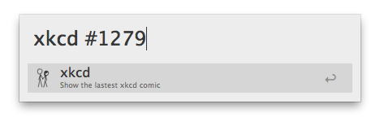
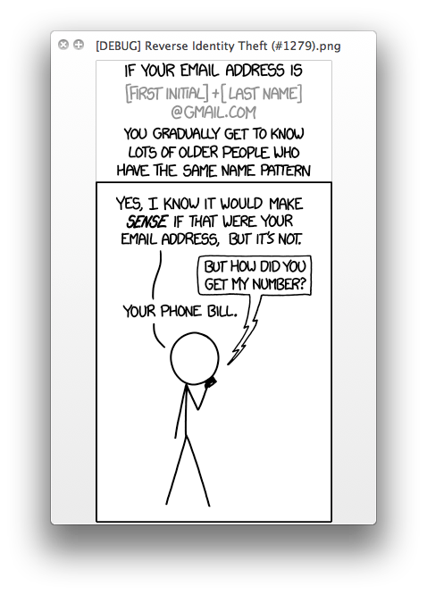

xkcd workflow
==

### Description
Simple Alfred 2 workflow to preview comics from the [xkcd](http://xkcd.com) blog. 

### Usage
This is pretty straight forward:  
`xkcd [optional argument]`

The `optional argument` can take one of several forms:
1. `xkcd 5` will show the comic with the specified offset from the latest one
2. `xkcd #1279` will show the comic with the specified number
3. `xkcd ..3` will show the last specified number of comics (last 3 comics in this case), *from newer to older*.
4. `xkcd #1277..#1275` will show the comics with the numbers from the specified range (#1275, #1276, #1277 in this case), *older to newer*.

If no argument is provided, or it doesn't match any of the previous patterns, the latest comic will be shown. Note that the limit of the number of comics shown in a single run is set to 5 (hardcoded on line 5 of the script). Feel free to change that. 

This workflow fetches images from the blog and displays them using QuickLook. To close an image one can just press the Space bar (as with any QuickLook previews). 

